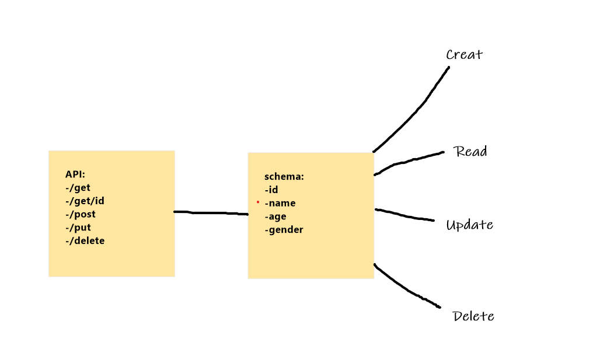

# REST-API

# serverLess API

---

## deploy link :

**[AWS API](https://rq46uvroah.execute-api.us-east-1.amazonaws.com/people)** 

---

## Routes:
`/POST` - create new one using req body

    name: String,

    age: String`
`/GET `- get all or include an id parameter to get one

`/PUT` - requires an id parameter and a body including name and phone

`/DELETE` - requires id parameter

---

## UML Diagram:
